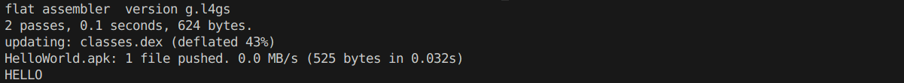
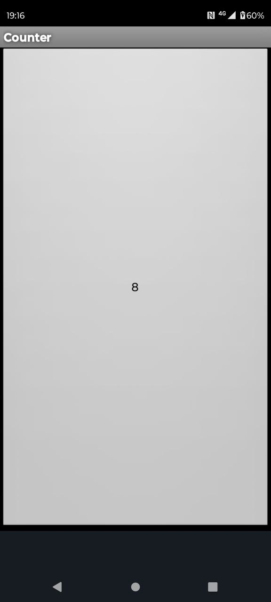
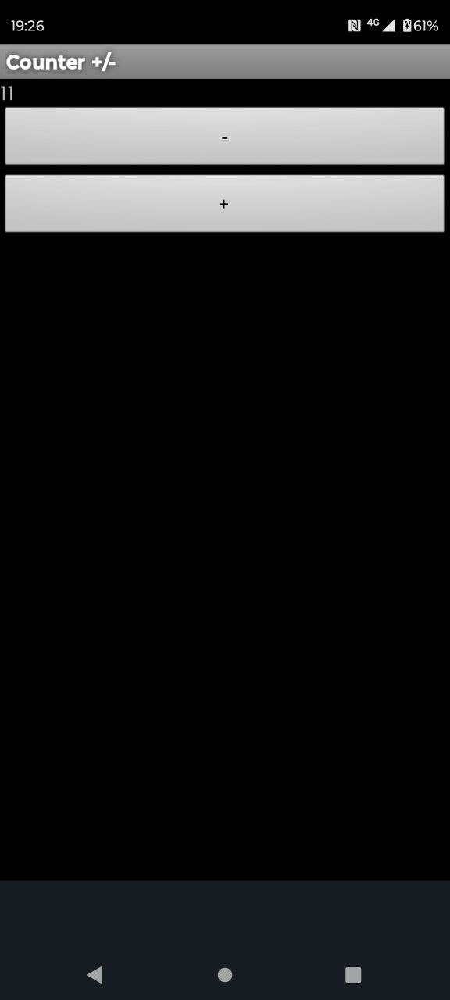
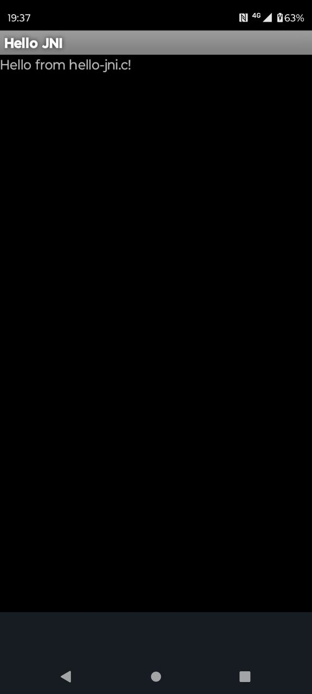

# forgedex

Hand-forge Android APKs using a macro assembler fasmg — no Java, no SDK, no Gradle.

Each example contains a single `.asm` file that produces a fully working APK,
except `hello_jni` which also includes a C file for the native library.

> There is no shared DSL or library yet.
> Signing requires [apksigner](https://github.com/akavel/apksigner) (Go)
> and manifest conversion requires
> [marco](https://github.com/akavel/marco) (Nim).

---

## How it works

A `.asm` file contains both the macro definitions (string pools, type lists, code items, etc.)
and the class logic itself — Dalvik bytecode written as `dw` words with inline comments.
The assembler resolves all offsets, pool indices, and checksums at build time.

---

## Repository layout

```
forgedex/
├── examples/
│   ├── hello_adb/
│   ├── hello_gui/
│   ├── counter_button/
│   ├── counter_plus_minus/
│   └── hello_jni/
├── deps/               ← built by setup_deps.sh, not committed
├── keys/               ← generated on first build, not committed
├── setup_deps.sh
├── LICENSE
└── README.md
```

---

## Prerequisites

| Tool | Description |
|------|-------------|
| **fasm** | used to bootstrap fasmg — `apt install fasm` |
| **fasmg** | macro assembler, built by `setup_deps.sh` from [tgrysztar/fasmg](https://github.com/tgrysztar/fasmg) |
| **marco** | converts `AndroidManifest.xml` to binary AXML, built by `setup_deps.sh` — requires [Nim](https://nim-lang.org/) |
| **apksigner** | signs APK files, built by `setup_deps.sh` — requires [Go](https://go.dev/) |
| **openssl** | generates signing keys — `apt install openssl` |
| **adb** | pushes and installs APKs to device (optional) |
| **zig** | cross-compiles native `.so` for `hello_jni` — [ziglang.org](https://ziglang.org/) (optional) |

### Build deps

```sh
sh setup_deps.sh
```

Clones, builds, and places `fasmg`, `marco`, `apksigner` in `deps/`.
To uninstall: `rm -rf deps/`.

---

## Setup — signing keys (one time)

Keys are generated automatically on first run of `build.sh`.

> `hello_adb` does not require signing keys.

---

## Build & install

Build a single example:

```sh
sh examples/counter_plus_minus/build.sh
```

Each example also supports:

```sh
sh build.sh --install    # build, install and launch via adb
sh build.sh --uninstall  # uninstall from device
```

---

## Examples

### hello_adb

Prints `HELLO` to the terminal via `dalvikvm` — no APK signing, no manifest.

This example is based on a post by [MaoKo](https://github.com/MaoKo) on the [flat assembler message board](https://board.flatassembler.net/topic.php?t=21689).

```sh
sh examples/hello_adb/build.sh
```



---

### hello_gui

A minimal `Activity` with a `TextView`.

```sh
sh examples/hello_gui/build.sh
```


---

### counter_button

A `Button` that increments a counter on each tap.

```sh
sh examples/counter_button/build.sh
```



---

### counter_plus_minus

A `TextView` with two buttons — increment and decrement. Decrement stops at zero.

```sh
sh examples/counter_plus_minus/build.sh
```



---

### hello_jni

Calls a native C function via JNI. The `.so` is compiled with `zig cc` and packed into the APK under `lib/arm64-v8a/`.

```sh
sh examples/hello_jni/build.sh
```



